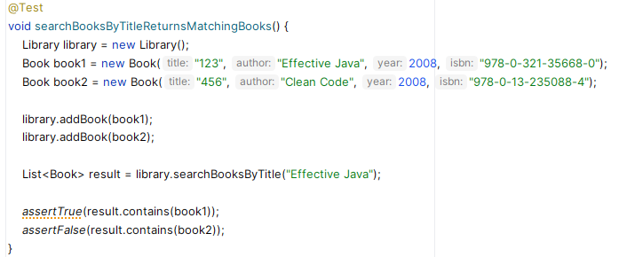
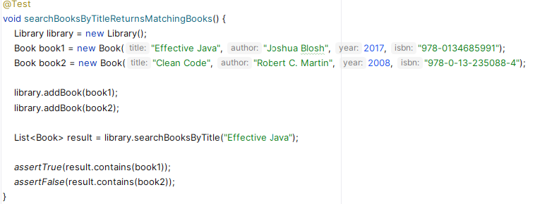

# 3. Aider à la mise en place de nouvelles règles métiers sur un projet existant simple

---

- [3.1 Avoir une vue d'ensemble du projet](#31-avoir-une-vue-densemble-du-projet)

- [3.2 Mettre en place des tests unitaires](#32-mettre-en-place-des-tests-unitaires)
  - [Couvrir la classe `Book`](#couvrir-la-classe-book)
  - [Couvrir la classe `LibraryMember`](#couvrir-la-classe-librarymember)

- [3.3 Aider à la *bonne* mise en place d'une nouvelle règle métier](#33-aider-à-la-bonne-mise-en-place-dune-nouvelle-règle-métier)
  - [Bien comprendre et implémenter la règle métier liée à la validité d'un ISBN (classe `ISBNValidator`)](#améliorer-la-qualité-du-code-de-la-règle-métier)
  - [Tester la règle métier (classe `ISBNValidatorTest`)](#tester-la-règle-métier-classe-isbnvalidatortest)
  - [Améliorer la qualité du code de la règle métier](#améliorer-la-qualité-du-code-de-la-règle-métier)

- [3.4 Aider à l'écriture d'une expression régulière (pattern matching)](#34-aider-à-lécriture-dune-expression-régulière-pattern-matching)

- [3.5 Discuter pour le plaisir de découvrir de nouveaux outils](#35-discuter-pour-le-plaisir-de-découvrir-de-nouveaux-outils)

- [3.6 Aider à l'utilisation de streams et lambdas](#36-aider-à-lutilisation-de-streams-et-lambdas)

- [3.7 Suggérer du code plus complexe (avec streams)](#37-suggérer-du-code-plus-complexe-avec-streams)

- [3.8 Explorer d'autres cas d'usage](#38-explorer-dautres-cas-dusage)

---

Commencez par cloner le projet **bookai** depuis le dépôt GitHub à l'adresse suivante : [https://github.com/iblasquez/bookai](https://github.com/iblasquez/bookai), puis ouvrez-le dans votre IDE préféré.

## 3.1 Avoir une vue d'ensemble du projet

Vérifiez d'abord que le projet compile bien, puis parcourez rapidement le code pour avoir une première impression.

Ce projet en est encore à ses débuts et semble s'inscrire dans le contexte métier d'une bibliothèque. Il est composé de trois classes principales : `Book`, `LibraryMember`, et `Library`.  
Aucun test n'a encore été réellement écrit dans `BookTest`.

Dans un projet aussi simple, il n'est pas nécessaire de faire appel à l'assistant de code pour obtenir une vue d'ensemble.

## 3.2 Mettre en place des tests unitaires

Afin de partir sur de bonnes bases (et réviser ce qui a été vu dans la partie précédente), vous allez commencer par ajouter des tests unitaires à ce projet.

### Couvrir la classe `Book`

- La classe `BookTest` existe déjà. Ouvrez-la, supprimez le test inutile qu'elle contient, et laissez votre assistant de code vous proposer une suite de tests que vous validerez.
- Exécutez les tests.
- Lancez la couverture de code. Comme la classe `Book` est un simple POJO, les deux ou trois tests proposés par votre assistant devraient suffire pour atteindre une couverture de 100%.

*Remarque : si vous ne savez pas ce qu'est un POJO, vous pouvez demander à votre assistant de code de vous l'expliquer.*

### Couvrir la classe `LibraryMember`

- Ouvrez la classe `LibraryMember` et dans le chat de l'assistant de code, utilisez la commande slash `/tests` (ou tapez directement `Generate unit tests`) pour générer les tests.
- Utilisez votre IDE pour créer la classe de test `LibraryMemberTest` au bon endroit et insérez-y le code généré par l'assistant.
- Assurez-vous que les tests compilent correctement **sans modifier le code de production**.
Si nécessaire, ajustez **le code des tests** pour qu'il fonctionne, par exemple peut-être devrez-vous compléter le constructeur de `Book` (avec ou sans l'aide de l'assistant).

- Par ailleurs, si l'assistant a généré une méthode de test comme `borrowBookTwice`, il vous faudra décider de la conserver ou non. Le comportement permettant de gérer l'emprunt d'un livre déjà emprunté n'est pas encore implémenté dans le code, à vous donc de choisir entre :

  - Supprimer ce test si ce comportement ne vous semble pas pertinent pour l'instant.
  - Conserver ce test si vous estimez qu'il est important de gérer cette situation dès maintenant, auquel cas vous devrez modifier le code de production pour que le test passe avec succès (avec ou sans l'aide de l'assistant).

- Lancez les tests et la couverture de code.
- Consultez la classe `LibraryMember`.

Si certaines portions de la classe `LibraryMember` ne sont pas couvertes par les tests (et si vous souhaitez qu'elles le deviennent), sélectionnez ces parties de code et  générez de nouveaux tests avec la commande `/tests`. Il ne vous reste plus qu'à insérer le code des nouveaux tests dans la classe `LibraryMember`, de les exécuter et de vérifier à nouveau la couverture de code.

> **Rappel :** Dans un projet, l'objectif n'est pas nécessairement d'obtenir 100% de couverture.  

Ici, l'idée est juste de montrer comment ajouter rapidement des tests unitaires.
D'ailleurs, pour l'instant, nous n'écrirons pas de tests pour la classe `Library`.

## 3.3 Aider à la *bonne* mise en place d'une nouvelle règle métier

### Bien comprendre et implémenter la règle métier liée à la validité d'un ISBN (classe `ISBNValidator`)

Retournez dans la classe `Book` et examinez ses attributs.
Vous constaterez que l'`isbn` est l'un des attributs du livre.

- Vous avez probablement une vague idée de ce qu'est un **isbn** (une suite de chiffres).
Pour plus de détails, vous pouvez demander dans le chat de votre assistant de code :
   `Pourrais-tu m'expliquer ce qu'est un ISBN ?`

Dans ce projet, la génération d'un ISBN ne nous intéresse pas, car l'ISBN est attribué lors de la publication du livre. Cependant, il est crucial de veiller à **éviter toute erreur humaine lors de la saisie d'un ISBN**. Garantir l'**intégrité des données** (validité et exactitude) est essentiel pour maintenir la qualité du développement.

Un ISBN, comme un numéro de carte bancaire ou de carte vitale, dispose probablement d'une **clé de contrôle** pour **assurer sa validité**. Ce n'est donc pas simplement une suite de chiffres aléatoires, mais un code qui suit une **règle métier**.
Laissez votre assistant de code vous aider à découvrir et à implémenter cette règle.

- Demandez à votre assistant :  
  `Sais-tu s'il existe une règle spécifique pour savoir si un ISBN est correct ?`

    L'assistant devrait vous fournir une explication et probablement une implémentation Java.
  - Si ce n'est pas le cas, posez-lui directement la question :
 `Pourrais-tu me proposer une implémentation java de cette règle métier ?`

- Créez ensuite une nouvelle classe `ISBNValidator` et insérez-y le code généré après avoir rapidement vérifié que l'implémentation proposée semble respecter la description de la règle.

**Remarque : Les réponses d'une intelligence générative étant probabilistes**, votre assistant peut avoir répondu de différentes manières aux questions précédentes. Il se peut que, dans la classe `ISBNValidator`, vous vous retrouviez avec une implémentation qui **vérifie un seul type d'ISBN**, alors qu'en réalité il en existe deux : **ISBN-10** (avant 2007) et **ISBN-13**.

- Vous pouvez **approfondir vos connaissance sur cette règle métier** en continuant à discuter avec l'assistant :
`Existe-il un autre type isbn ?` (question à poser si l'assistant n'a mentionné qu'ISBN-13)
`Quelle est la structure d'un ISBN-10 ?`
`Quelle est la structure d'un ISBN-13 ?`
`Quelle est la différence entre ISBN-10 et ISBN-13 ?`

- **Si l'assistant ne vous a initialement proposé qu'une seule méthode** pour vérifier la validité de l'ISBN,
  - demandez-lui maintenant :
    `Pourrais-tu me proposer une implémentation java pour l'isbn10 ?`
    (adaptez bien sûr votre question en fonction de ce que vous a déjà proposé l'assistant de code)
  - Insérez ensuite ce nouveau code dans la classe `ISBNValidator`, en veillant à ce qu'il corresponde bien à la règle métier.

- **Veillez toujours à examiner les réponses générées par un assistant avant de les intégrer à votre code**. Par exemple, assurez-vous ici que la validation de l'ISBN-10 prend correctement en compte les cas particuliers, comme l'utilisation du caractère "X".

### Tester la règle métier (classe `ISBNValidatorTest`)

- Ensuite, créez une classe `ISBNValidatorTest` et, avec l'aide de votre assistant, générez des tests couvrant les deux méthodes de validation de l'ISBN.
**Soyez attentif à la qualité du code de vos tests** et veillez à ce qu'ils respectent **les bonnes pratiques** : évitez d'avoir un seul test avec de multiples assertions et privilégiez des méthodes bien nommées qui respectent le pattern AAA (Arrange, Act, Assert).
Pour cela, il est préférable de sélectionner le code à tester et d'utiliser la commande `/test` (ou le prompt `Generate unit tests`) pour générer les tests, plutôt que de laisser les tests se générer automatiquement en plaçant simplement le curseur dans la classe `ISBNValidatorTest`

- **Lancez les tests. Est-ce que tous les tests passent ?**
Si certains échouent, ne modifiez pas le code de production immédiatement. Vérifiez d'abord si les valeurs utilisées dans les tests sont correctes : certes, elles font passer le(s) test(s), mais correspondent-elles à un ISBN valide ?

- En effet, pour **garantir la qualité des tests**, il est crucial d'être **attentif à la qualité des données de vos tests** (que l'assistant de code ne nous garantit pas forcément).
Pour être sûr de **tester avec des données de qualité**, vous allez maintenant ***revisiter*** (c-a-d modifier) les tests générés et les ajuster **en utilisant comme exemples dans vos tests de *véritables valeurs ISBN***, à savoir :

  - `9780321146533` quand votre test est censé vérifié qu'un **ISBN-13 est correct**
    Cet ISBN-13 n'est autre que celui du livre *Test-Driven Development* de Kent Beck

  - `020161622X` quand votre test est censé vérifié qu'un **ISBN-10 est correct** avec la **présence d'un X**
    Cet ISBN-10 n'est autre que a version originale de 1999 du livre The Pragmatic Programmer" de Andrew Hunt et David Thomas.
Cet ISBN-10 n'est autre que a version originale de 1999 du livre The Pragmatic Programmer" de Andrew Hunt et David Thomas.

  - `0321125215` quand votre test est censé vérifié qu'un **ISBN-10 est correct**
  Cet ISBN-10 est celui du livre *Domain Driven Design* d'Eric Evans.

- **Pour tester un ISBN mal formé ou invalide**, vous pouvez simplement **modifier le dernier chiffre, car celui-ci est la clé de contrôle**.

- Si les tests ne passent pas avec les données de qualité ci-dessus, demandez à votre assistant de vous regénérer le code qui pose problème.  

**Conseil** : *Comme tout refactoring, adoptez une approche méthodique pour **revisiter/ajuster** vos tests avec les véritables valeurs. Avancez progressivement **petits pas par petits pas** : modifiez une valeur, relancez le test correspondant, puis passez au test suivant*.

- Une fois les deux règles de validation d'ISBN implémentée, la *revisite* des tests terminée, **relancez tous les tests et la couverture de code** pour vous assurer que la classe ISBNValidator est bien couverte à 100% en vue d'un petit refactoring du code de production.

### Améliorer la qualité du code de la règle métier

- Revenez dans la classe `ISBNValidator`.
L'assistant a généré un code fonctionnel qui répond au besoin, mais ce code est-il de qualité ? Demandez maintenant à l'assistant :
`Comment puis-je améliorer la qualité du code de la classe ISBNValidator ?`

- Une IA générative ayant toujours une réponse à proposer, l'assistant devrait vous fournir un code de meilleure qualité. Vérifiez que ces améliorations vous conviennent (par exemple, les *magic numbers* ont-ils été éliminés ? Des méthodes ont-elles été extraites ? Des exceptions ont-elles été mises en place, etc.).
  - **Si la qualité de code vous convient**, intégrez ce code dans votre projet en remplacement du code existant, puis relancez les tests pour vous assurer que les règles de validation de l'ISBN sont toujours respectées.

  - **Si la qualité du code ne correspond pas à vos attentes**, soyez plus précis dans vos demandes en ciblant une seule mauvaise odeur à la fois :
    `Pourrais-tu supprimer les magic numbers ?`
    - Si le code généré vous convient, intégrez-le à la place de l'ancien et relancez les tests.
    - Si vous pensez pouvoir encore améliorer la qualité du code, poursuivez la discussion avec votre assistant et continuez le refactoring petit pas par petit pas, en éliminant chaque mauvaise odeur de code au fur et à mesure et relançant les tests à chaque fois.
    `Pourrais-tu procéder à des extract method ?`
    `[…]`

N'oubliez pas que **c'est votre expertise et vos bonnes pratiques qui garantiront la qualité du code**.
Les assistants de code peuvent vous aider à générer du code rapidement, mais **une revue attentive est nécessaire pour éviter l'accumulation de dette technique, qui pourrait devenir coûteuse à long terme comme le montre certaines études comme [gitclear](https://www.gitclear.com/coding_on_copilot_data_shows_ais_downward_pressure_on_code_quality) et [uplevelteam](https://resources.uplevelteam.com/gen-ai-for-coding).
En effet à ce jour, les modèles des assistants de code tendent à reproduire la dette technique présente dans les données sur lesquelles ils ont été entraînés. Toutefois, au rythme rapide où évoluent les modèles de langage (LLM), on peut espérer qu'ils bénéficieront un jour de jeux de données plus qualitatifs et de nouvelles techniques d'apprentissage qui pourraient leur permettre d'améliorer progressivement la qualité du code qu'ils génèrent.

## 3.4 Aider à l'écriture d'une expression régulière (pattern matching)

Les expressions régulières sont des modèles utilisés pour identifier des combinaisons spécifiques de caractères dans des chaînes.
**Ecrire une expression régulière est souvent perçue comme une tâche fastidieuse par les développeurs**, l'assistant de code peut vous aider à les générer rapidement.

- Ouvrez la classe `LibraryMember` et demandez à votre assistant dans le chat :
`Pourrais-tu me créer une expression régulière pour valider un email ?`

L'assistant vous proposera probablement une expression régulière dont la première partie ressemble à : `^[a-zA-Z0-9._%+-]+` où :
&#8594; le symbole `^` marque le début de la ligne : l'adresse e-mail doit commencer ici.
&#8594; La partie entre crochets `[…]+` spécifie que l'adresse e-mail doit contenir un ou plusieurs (`+`) caractères définis à l'intérieur des crochets : minuscules (`a-z`), majuscules (`A-Z`), chiffres (`0-9`), ou certains caractères spéciaux comme le point (`.`), l'underscore (`_`), le pourcentage (`%`), le signe plus (`+`) ou le trait d'union (`-`).
&#8594; La partie qui suit le symbole `@`, obligatoire dans toute adresse e-mail, peut varier, et donc être plus ou moins contraignante, en fonction de la réponse générée par l'assistant, qui reste probabiliste. Si vous avez des exigences spécifiques pour cette partie de l'expression, n'hésitez pas à les indiquer à l'assistant afin d'affiner le modèle.

**Gardez à l'esprit que l'assistant peut vous faire gagner du temps en limitant les tâches répétitives et fastidieuses, mais qu'il est essentiel de toujours vérifier et ajuster le code généré pour qu'il réponde précisément à vos besoins.**

- Si vous souhaitez **approfondir la contrainte sur les noms de domaine**, vous pouvez poser la question suivante à l'assistant :
`Quelles sont les règles classiques pour les noms de domaines dans les emails ?`

- Une fois que vous avez pris connaissance de ces règles,  demandez à votre assistant de réécrire la méthode `isValidEmail` en tenant compte de ces contraintes.

## 3.5 Discuter pour le plaisir de découvrir de nouveaux outils

- La validation des e-mails n'est pas une fonctionnalité propre à votre application.
Il est évident que de nombreux développeurs ont déjà implémenté cette règle avant vous.
Par curiosité, vous pourriez demander à votre assistant :
`Pourrais-tu écrire ce code autrement ?`
`Y-a-t-il d'autres méthodes que le pattern matching pour valider un mail ?`

- Votre assistant vous incitera certainement à approfondir vos connaissances dans ce domaine en vous proposant des questions comme :
`Quelles sont les autres méthodes pour valider une adresse e-mail en Java ?`
`Quelles bibliothèques tierces existent pour valider une adresse e-mail en Java ?`
`[…]`

Vous découvrirez ainsi qu'il existe plusieurs approches pour valider une adresse e-mail, en plus du pattern matching. Pourquoi réinventer la roue ? Après cette discussion enrichissante, vous pourrez choisir la solution la plus adaptée à vos besoins.

## 3.6 Aider à l'utilisation de streams et lambdas

- Placez-vous à la fin de la classe `Library`, commencez à taper :  
  `public List<Book> search`  

- Laissez l'assistant de code proposer une signature et une implémentation.
L'objectif est de continuer à taper jusqu'à ce qu'il propose de générer la méthode suivante :
 `public List<Book> searchBookByTitle(String Title)`
Après avoir rapidement vérifié que l'implémentation de cette méthode correspond à son intention métier, **validez-la**.

- Utilisez ensuite l'assistant pour générer les tests qui couvrent cette méthode en sélectionnant le code de la méthode et en utilisant `/tests`
Faites compiler le code en ajoutant éventuellement les `imports` nécessaires.

Si un test échoue, examinez attentivement la **qualité des données utilisées dans ce test**.
    En effet, si tout comme moi, les probabilités ne sont pas avec vous aujourd'hui, vous pourriez être victime de l'**hallucination** suivante :

&#8594; À première vue, les données du test peuvent paraître correctes, mais le test échoue sur l'assertion `assertTrue`. En effet, l'assistant de code a utilisé, par erreur, la valeur d'un **auteur** d'un livre comme paramètre dans la méthode `searchBookByTitle` au lieu de la valeur d'un **titre**.
    Cette confusion est probablement due à la ***primitive obsession*** dans la signature du constructeur de `Book`, qui prend trop de paramètres de type `String`.
    **L'assistant n'a donc pas su faire la distinction entre les différents paramètres `String` et n'a pas reconnu celui correspondant au `titre`.**
    Pour faire passer le test avec les données actuelles, il faudrait donc passer `123` en paramètre à la place de `Effective Java`.

&#8594; Cependant, en écrivant `123` comme paramètre d'entrée pour la méthode `searchBooksByTitle`, vous vous rendez compte que les données de test sont de mauvaise qualité. En effet, pour un œil humain, dans le contexte métier de l'application, `Clean Code` ou `Effective Java` sont de véritables titres de livres.
    Dans les tests qu'il a générés, l'assistant a pris ces valeurs comme exemples pour les noms d'auteurs, ce qui est inapproprié et risque d'induire des erreurs/confusions lors de la (re)lecture ou de l'interprétation manuelle des tests.  
    Au passage, on peut également noter que l'ISBN utilisé dans l'exemple du livre *Effective Java* n'était pas le *bon* car c'est en réalité le véritable ISBN du livre *Design Patterns: Elements of Reusable Object Oriented Software* du Gang of Four 😉.

&#8594; Pour améliorer la lisibilité (et donc la compréhension) de votre test, il est recommandé d'ajuster le test avec de **véritables valeurs métiers**, plus pertinentes et cohérentes.  
Le test précédent, revisité dans ce sens, ressemble maintenant à cela :

Cette hallucination nous donne l'occasion de rappeler qu'**il faut être très vigilant à la qualité des données dans les tests générés**, et que les valeurs prises comme exemple, tout comme le code, nécessitent une relecture de votre part.  
Toutefois, il est intéressant de remarquer qu'une **hallucination** de l'assistant peut aussi **mettre sur la voie des problèmes de conception** (mauvaises odeurs), que seule votre expertise détectera.

- Une fois les tests corrigés, **relancez-les** pour vous assurer qu'ils passent bien tous.

- Si l'assistant a généré un code utilisant une boucle `for`, mais que vous préférez travailler avec des **streams**, sélectionnez tout le code de la méthode `searchBookByTitle` et demandez à votre assistant :  
`refactor this to use streams`  
Remplacez ensuite le code existant par celui généré, puis relancez les tests pour vérifier que le comportement reste inchangé.

## 3.7 Suggérer du code plus complexe (avec streams)

- Placez-vous maintenant à la fin de la classe `Library` et tapez dans votre code un commentaire décrivant une fonctionnalité plus complexe comme par exemple :  
`Implement a method to sort books by year, then by author name`

- Essayez également le commentaire suivant :
`Implement a method to search for books by keyword in title or author`

L'assistant vous proposera probablement une implémentation utilisant directement des streams et des lambdas (`->`).
Si ce n'est pas le cas, demandez-lui de refactorer le code en utilisant des streams, comme précédemment.

## 3.8 Explorer d'autres cas d'usage

Le dernier petit cas d'usage que vous allez explorer dans ce projet est la conversion entre formats de données
Demandez à votre assistant via le chat :
`Ajoute une méthode pour exporter les données des livres en JSON`

L'assistant devrait alors vous guider sur où et comment implémenter cette méthode.

En fonction de votre contexte et de vos besoins, vous découvrirez encore de nombreux cas d'usage tout au long de vos phases de développement. À vous de jouer !

---

***Accédez donc maintenant à la partie suivante qui est : [3. Aider à la mise en place de nouvelles règles métiers sur un projet existant simple](4_ProjetExistantComplexe.md) ou retournez à l'[Accueil](README.md).***

---
