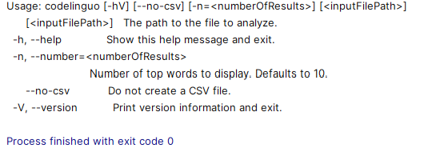
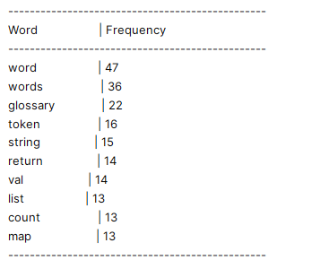

# 4. Quid d'un assistant de code pour la reprise d'un projet complexe existant (legacy code)

[4.1 Avoir une vision et une compréhension globale du projet](#4-quid-dun-assistant-de-code-pour-la-reprise-dun-projet-complexe-existant-legacy-code)

- [4.1.a Première vision globale du projet](#41a-première-vision-globale-du-projet)
- [4.1.b Garder une trace de la vision globale du projet dans un README](#41b-garder-une-trace-de-la-vision-globale-du-projet-dans-un-readme)
- [4.1.c Approfondir la vision globale du projet](#41c-approfondir-la-vision-globale-du-projet)
        - [Explorer les points d'entrée du système](#explorer-les-points-dentrée-du-système)
        - [Explorer le métier](#explorer-le-métier)
            &#8594; [Zoom sur la classe `WordAnalyticsService`](#zoom-sur-la-classe-wordanalyticsservice)
            &#8594; [IDE ou Assistant ?](#ide-ou-assistant-)
            &#8594; [Zoom sur la classe `FileReader`](#zoom-sur-la-classe-filereader)
            &#8594; [Zoom sur la classe `JavaFileParser`](#zoom-sur-la-classe-javafileparser)
            &#8594; [Essayer de comprendre rapidement un choix de conception](#essayer-de-comprendre-rapidement-un-choix-de-conception)
        - [Vision plus globale du métier (module `common`)](#vision-plus-globale-du-métier-module-common)
        - [Vision plus globale du projet et précision des réponses](#vision-plus-globale-du-métier-module-common)

[4.2 Mettre en place un environnement de développement fonctionnel](#41c-approfondir-la-vision-globale-du-projet)

Dans un article récent intitulé [Legacy Modernization meets GenAI](https://martinfowler.com/articles/legacy-modernization-gen-ai.html), Martin Fowler a écrit :  
> *Jusqu'à présent, la majorité de l'attention portée à l'intelligence artificielle générative (GenAI) dans le développement logiciel est axée sur la génération de code. Mais nous croyons qu'il y a autant, voire plus, de valeur dans la compréhension du code existant - en particulier des systèmes hérités complexes, volumineux et anciens.*

**GitHub Copilot** est un outil d'IA générative pour le code parmi d'autres ([Codeium](https://codeium.com), [Cursor](https://www.cursor.com),[Tabnine](https://www.tabnine.com),..) qui peut nous aider dans ce sens, en nous fournissant aussi bien une vue d'ensemble d'un système, qu'en détaillant des points précis d'un code legacy pour mieux le comprendre et éventuellement en améliorer sa qualité.  
Pour ce tutoriel, vous utiliserez le code du projet **`codelinguo`** développé par un groupe d'étudiants de 3ème année de BUT Informatique dans le cadre d'une SAE (Situation d'Apprentissage et d'Évaluation).  
Vous commencerez donc par **cloner ce projet** : [https://github.com/carlodrift/codelinguo](https://github.com/carlodrift/codelinguo)  
et ouvrirez ce projet dans votre IDE préféré muni de Copilot (IntelliJ ou Visual Studio).

> **Disclaimer :** Tout au long de ce tutoriel, restez attentif aux réponses fournies par votre assistant de code. Comme tout outil d'IA générative, il peut parfois produire des "**hallucinations**". Bien que ces outils soient très pratiques, il est essentiel de garder un esprit critique. Votre libre arbitre reste indispensable pour faire la part des choses entre les suggestions de l'assistant et la réalité de votre projet.

*Pour le moment, contentez-vous uniquement d'ouvrir ce projet dans votre IDE préféré.  
Pour obtenir une vue d'ensemble du projet, il n'est pas utile d'essayer de compiler ou de builder le projet (ce point sera traité un peu plus tard).
Ayez juste le code de votre projet sous les yeux dans l'IDE, avec un chat Copilot ouvert, et laissez-vous guider...*

## 4.1 Avoir une vision et une compréhension globale du projet

### 4.1.a Première vision globale du projet

Après avoir ouvert le chat de votre assistant de code dans votre IDE, vous pouvez interagir avec lui, que ce soit en français ou en anglais, de manière plus ou moins détaillée comme vu précédemment.

- Commencez, par exemple, par lui demander une vision globale du projet en anglais :  
  `describe this project`

- ou en français :  
  `Pourrais-tu me décrire ce projet`

- ou même en utilisant des agents de conversation  
  `/explain @workspace`

**Au-delà de votre assistant de code**, vous disposez toujours de votre expérience/expertise en développement logiciel. **Explorez également manuellement le projet dans votre IDE** (architecture, noms des classes…).
**En dépliant l'arborescence du projet**, vous constatez qu'il est structuré autour de :

- 3 modules **Maven** : `cli`, `common`, `desktop`
- 1 module **Gradle** : `intellij-plugin`

Selon votre expérience/expertise, vous avez peut-être envie de poser des questions supplémentaires à votre assistant :
`À quoi correspond cli ? desktop ? intellij-plugin ? common ? dans ce projet`

Et si vous lui reposez ensuite la question :  
`Pourrais-tu me décrire le projet ?`

La réponse sera plus détaillée que précédemment, car au fil des discussions, **l'assistant enrichit son contexte des informations apprises lors des échanges précédents.**

**Au-delà des questions techniques**, vous pouvez également interroger l'assistant sur la finalité de l'application avec des questions telles que :
`Quel est selon toi le contexte métier de l'application ?`
`À quoi sert cette application ?`

### 4.1.b Garder une trace de la vision globale du projet dans un README

Dans un projet collaboratif, le fichier `README` est essentiel pour fournir une vue d'ensemble et aider les collaborateurs à se familiariser rapidement avec le projet.  
Le projet que vous avez récupéré n'en contient pas ? Pas de souci, vous pouvez demander à l'assistant de générer un `README` basé sur ce qu'il a *vu* dans le projet, en utilisant par exemple le prompt suivant :

`@workspace generate a readme document that can be used as a repo description`

> **Remarque :** *Pour l'instant, vous êtes juste en mode exploration du projet avec votre assistant de code, sans intention d'ajouter de code. Si plus tard vous décidez d'inclure un `README` dans le projet, vous pourrez réutiliser le prompt précédent. Grâce aux nombreuses interactions que vous aurez eues entre-temps, le `README` généré n'en sera que plus détaillé et pertinent.*

### 4.1.c Approfondir la vision globale du projet

Pour aller plus loin dans votre compréhension, continuez à interroger/challenger l'assistant sur les points d'entrée du système et quelques classes métier de l'application.

#### Explorer les points d'entrée du système

Votre assistant vous a déjà peut-être mentionné les points d'entrée, n'hésitez pas à lui demander explicitement de les énumérer à nouveau :
`Quels sont les points d'entrée du système ?"`

**Remarque :** *La réponse que vous obtiendrez peut être une **hallucination** (sur le nom de la classe considérée comme point d'entrée), mais elle devrait néanmoins vous guider dans la bonne direction.*

- **Commencez par ouvrir** le fichier `Main.java` dans le module `cli` (`fr.unilim.codelinguo.cli`) et, de la même manière que tout ce qui a été fait précédemment, posez des questions comme :  
  `Pourrais-tu me décrire ce code ?`
  `/explain this`,  
  `/explain this class`  
  *(à vous de voir le type de formulation et le(s) langue(s) que vous préférez utiliser)*

- **De la même manière**, ouvrez le fichier `Main.kt` dans le module `desktop` (`fr.unilim.codelinguo.desktop`) et discutez avec votre assistant de code.

- **Enfin**, ouvrez le fichier `Main.java` dans le module `intellij-plugin` (`fr.unilim.codelinguo.intellijplugin`) et échangez avec votre assistant.

Dans les réponses de l'assistant, certains noms de classes métier, comme `FileReader` et `WordAnalyticsService`, vont probablement ressortir plusieurs fois. Cela devrait vous inciter à explorer le module `common` pour en apprendre davantage sur le domaine métier de l'application.

#### Explorer le métier

Vous pouvez explorer le côté métier de l'application de manière plus ou moins détaillée.
Par où commencer ? Pourquoi ne pas débuter avec la classe `WordAnalyticsService`, mentionnée lors de vos précédents échanges ?

##### Zoom sur la classe `WordAnalyticsService`

- Pour commencer, **localisez la classe** dans le projet et **ouvrez la classe**.
Pour cela, aidez-vous de l'assistant  en lui demandant :
`Où se trouve la classe WordAnalyticsService ?`

- Une fois la classe ouverte, **engagez la discussion** avec l'assistant pour obtenir une **vision globale de la classe** :
  - `Que fait ce code ?`
  - `Pourquoi la classe WordAnalyticsService ?` (pour une réponse plus ***métier***)
  - `/explain this` (pour une réponse plus ***technique*** expliquant ***comment*** le code fonctionne)

Vous venez d'obtenir des réponses plus ou moins détaillées, plus ou moins orientées métier, plus ou moins techniques. Il est donc important de remarquer que, outre le caractère probabiliste des réponses générées par une IA Générative, **le style et le contenu de la réponse vont être différents suivant la manière dont vous posez vos questions (prompt).**

Pour vous en convaincre, testez différentes formulations pour voir comment elles influencent les réponses de l'assistant :

- `Pourrais-tu me décrire la classe WordAnalyticsService`
- `Pourrais-tu m'expliquer la classe WordAnalyticsService`
- `A quoi sert la classe WordAnalyticsService ?`
- `Explain how the code works ?`
- `Explain how this code can be used ?`
- `Explain why this code exists ?`
- `...`

> Lorsque vous échangez avec une IA générative, pour obtenir des **réponses pertinentes**, il est important d'**apprendre à bien communiquer avec *cette* IA, un peu comme on apprendrait à communiquer dans une nouvelle langue étrangère** (utiliser les bonnes formulations, les mots adéquats, poser les questions au bon moment…).
Il est donc nécessaire de **vous entraîner à discuter avec *votre* IA** afin de trouver les formulations et le mode d'expression qui correspondent à vos besoins. **Prendre le temps d'apprendre à formuler votre prompt avec précision est un passage essentiel pour obtenir des réponses précises** et être encore plus productif avec votre IA

 **Disclaimer :** *À long terme, votre style de communication différera sûrement du phrasé proposé dans ce tutoriel. Ce tutoriel est uniquement conçu pour vous aider à survoler quelques cas d'usage qui pourraient vous être utiles au quotidien, en se basant sur des interactions simples. Libre à vous, par la suite, de personnaliser et perfectionner votre langage pour interagir efficacement avec votre assistant de code préféré.*

- Il est maintenant temps d'explorer **les dépendances** de la classe `WordAnalyticsService`.  
Posez la question suivante à l'assistant :
`Quelles sont les dépendances de cette classe ?`
En fonction de la réponse obtenue, continuez la discussion :
  - `Pourquoi la classe Word ?`
  - `Que fait le code de la classe Word ?`
  - `[...]`
N'hésitez pas à poursuivre les échanges avec l'assistant pour approfondir votre compréhension de cette classe.

##### IDE ou Assistant ?

Ouvrez maintenant la classe `Glossary` et interagissez, comme à votre habitude, avec l'assistant :

- `Pourquoi la classe Glossary ?`
- `Que fait ce code ?`
- `/explain this`
- `[...]`

Ensuite, posez la question suivante :

- `Pourrais-tu me donner toutes les classes qui dépendent de Glossary ?`

Il est fort probable que votre assistant vous suggère, pour un tel cas d'usage, de **plutôt utiliser les outils de l'IDE pour une réponse plus complète**. Vous devriez obtenir des réponses du type :
***Pour une analyse complète, il serait nécessaire de rechercher toutes les occurrences de Glossary dans le projet*** ou *Pour une recherche exhaustive, vous pouvez utiliser les fonctionnalités de recherche de votre IDE (IntelliJ IDEA) pour trouver toutes les occurrences de Glossary dans le projet.*

> C'est donc le bon moment pour rappeler qu'il est essentiel d'**utiliser son assistant de code de manière réfléchie et pour des cas d'usages pertinents**, d'autant plus que les requêtes faites auprès d'outils d'IA générative ont un **coût énergétique très (voire trop) élevé de nos jours**.

##### Zoom sur la classe `FileReader`

Lors de vos premiers échanges sur la vision globale du projet, la classe `FileReader` a probablement été mentionnée par votre assistant. C'est le moment d'en apprendre davantage sur elle.

**Ouvrez** la classe `FileReader` et discutez avec votre assistant :

- `Pourquoi la classe FileReader ?`
- `Que fait ce code ?`
- `/explain this`
- `[...]`

Les réponses fournies par votre assistant ne vous auraient-elles pas donné envie d'aller explorer la classe  `JavaFileParser` ?

##### Zoom sur la classe `JavaFileParser`

**Ouvrez la classe `JavaFileParser`** et engagez la discussion :

- `Pourquoi la classe JavaFileParser ?`
- `Que fait ce code ?`
- `/explain this`
- `[...]`

Demandez ensuite à votre assistant :

- `Où est utilisée la classe JavaFileParser ?`
  - &#8594; Si vous avez de la chance (que les probabilités sont avec vous), l'assistant pourrait vous révéler l'extrait de code suivant tiré de la classe `FileReader` :

    ```kotlin
    private val fileSanitizers = mapOf(
        ".java" to JavaFileParser(),
        ".kt" to KotlinFileSanitizer(),
        ".py" to PythonFileSanitizer(),
        ".js" to JavascriptFileSanitizer(),
        ".html" to HtmlFileSanitizer()
    )
    ```

  - &#8594; Si vous n'avez pas eu la chance d'obtenir ce bout de code, reformulez votre question :
    `Montre-moi comment est utilisé JavaFileParser ?`

Si vous n'obtenez toujours pas le bout de code recherché (**les réponses des IA génératives étant probabilistes, même avec une formulation très précise, il est impossible de garantir un résultat**), allez directement dans la classe `FileReader` pour vérifier que ce bout de code y est bien présent.

Comme mentionné en début de tutoriel, **quelle que soit la réponse obtenue, il est toujours préférable de vérifier sa cohérence avec le contenu du projet pour s'assurer qu'il ne s'agit pas d'une *hallucination***. Ainsi, dans tous les cas, un *bon* réflexe consiste à aller vérifier que le code est bien présent dans la classe `FileReader`.

##### Essayer de comprendre rapidement un choix de conception

Relisez attentivement l'extrait de code précédent.  
La lecture de ce code ne soulève-t-elle pas chez vous quelques questions du genre :  
*Pourquoi utilise-t-on `JavaFileParser` pour les fichiers `.java`, alors que pour d'autres langages, on emploie des `Sanitizers` ? D'autant plus qu'en explorant l'arborescence, vous remarquez qu'un fichier `JavaFileSanitizer` existe bien dans le projet.*

Si vous ne souhaitez pas passer trop de temps à comprendre ce choix de conception, demandez directement à l'assistant de vous éclaircir sur ce point :  

- `Où est utilisée la classe JavaFileSanitizer ?`
- `Pourquoi utiliser JavaFileParser plutôt que JavaFileSanitizer ?`
- `Quand faut-il utiliser JavaFileParser et quand JavaFileSanitizer ?`
- `[...]`
*(à vous de trouver la bonne formulation pour élucider et comprendre rapidement ce choix de conception qui peut paraître étonnant à la lecture de code)*

#### Vision plus globale du métier (module `common`)

Les interactions précédentes ont permis à votre assistant de code, ainsi qu'à vous-même, d'en apprendre un peu plus sur le projet.  
En ce qui concerne le module `common`, vous avez, jusqu'à présent, exploré certains points de détails de ce module. Pour obtenir une vision plus générale de ce module et mieux comprendre son rôle dans le projet, demandez à votre assistant :

- `Pourrais-tu me décrire`common`?`
- `Que comprends-tu de la problématique métier de cette application ?`
- `[...]`

Pensez-vous que les réponses apportées par l'assistant ont été influencées par les interactions que vous avez eues précédemment ?

#### Vision plus globale du projet et précision des réponses

Au fur et à mesure que vous échangez avec votre assistant de code, ses réponses deviennent de plus en plus précises. Si vous lui demandez à nouveau une vision globale du projet avec les mêmes questions qu'au début de la discussion :

- `Describe this project`
- `Pourrais-tu me décrire ce projet`
- `/explain this project`
- `[...]`

Vous constaterez que les réponses sont plus détaillées et spécifiques qu'au début de la discussion. Cela s'explique par le fait que, lors de vos interactions, l'assistant a exploré différentes parties du projet en fonction des questions posées. Il a ainsi mémorisé des informations sur ces parties, lui permettant d'affiner son contexte et donc de fournir des réponses plus pertinentes et ciblées.

> Cela montre **l'importance d'interagir progressivement, étape par étape, avec votre assistant de code.** En **posant des questions de plus en plus précises**, vous affinez la compréhension du projet et **améliorez la qualité des réponses de l'assistant.**

Toutefois, une des **limites actuelles** des assistants de code est que **la mémoire est limitée à la session/discussion en cours.** Si vous démarrez une nouvelle session, la connaissance acquise sur le projet sera perdue. À ce jour, il n'y a pas de mémoire à long terme ou **RAG** (Retrieval Augmented Generation) dans les assistants de code. Cependant, des évolutions sont sûrement en préparation, comme le montre la fonctionnalité de mémoire entre conversations récemment introduite dans les versions de ChatGPT.

## 4.2 Mettre en place un environnement de développement fonctionnel

Jusqu'à présent, l'assistant de code vous a uniquement aidé à comprendre le comportement du code existant, sans vérifier si ce dernier était compilable et fonctionnel.  
Si vous souhaitez aller plus loin avec ce code (effectuer du refactoring, ajouter de nouvelles fonctionnalités, etc.), il devient nécessaire de faire compiler ce projet et de l'exécuter dans votre IDE préféré.

> *Pour continuer ce tutoriel, l'objectif est simple : assurez-vous que le **projet compile** et que vous pouvez **lancer le `main` du module `cli` depuis l'IDE**. (Concentrez-vous uniquement sur ce `main`, cela garantit déjà un environnement de développement fonctionnel.)*

Dès que vous pouvez exécuter (**Run**ner)  le `Main` du module `cli` depuis votre IDE et que vous visualisez une exécution correcte dans la console (comme montré dans l'exemple ci-dessus pour une **exécution du `main` sans paramètre**), vous serez prêt à poursuivre.



Ensuite, toujours depuis l'IDE, lancez le `Main` du module `cli` **en passant comme premier** (et seul) **paramètre le chemin absolu du fichier `WordAnalyticsService.java` du projet `codelinguo`** que vous avez sous les yeux.  
Si tout se déroule correctement, vous devriez voir un affichage dans la console similaire à la capture d'écran ci-dessous :



**Bien entendu, l'assistant de code est aussi votre ami pour résoudre des problèmes liés au bon fonctionnement de votre IDE ou à votre environnement de travail. Il ne se limite pas à l'interaction avec le code.**  
Si nécessaire, n'hésitez pas à solliciter son aide en lui posant, par exemple, l'une des questions suivantes :

- `Comment lancer le main du module cli ?`
- `Comment lancer le main du module cli depuis l'IDE ?`
- `Comment lancer le main du module cli depuis l'IDE en passant le chemin absolu du fichier WordAnalyticsService.java comme paramètre ?`
- `[...]` Continuez éventuellement cette discussion en fonction de vos besoins et de votre expérience si vous avez besoin d'informations supplémentaires pour arriver à vos fins, c'est-à-dire obtenir des affichages similaires aux captures d'écran ci-dessus.
