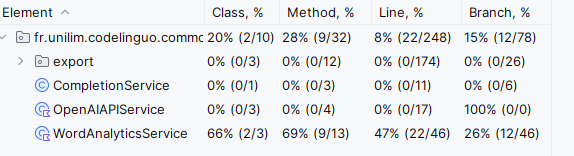

# 3. Assisting with Working on Complex Legacy Projects

In a recent article titled [Legacy Modernization meets GenAI](https://martinfowler.com/articles/legacy-modernization-gen-ai.html), Martin Fowler wrote:

> *So far, most attention to Generative Artificial Intelligence (GenAI) in software development is on generating code. But we believe there is as much, if not more, value in understanding existing code - particularly long-lived, large, and complex legacy systems.*

**GitHub Copilot** is one among several AI coding assistants ([Codeium](https://codeium.com), [Cursor](https://www.cursor.com), [Supermaven](https://supermaven.com/), [Tabnine](https://www.tabnine.com),..) that can help in this direction.
It can provide both an overview of a system and insights into specific parts of legacy code to better understand and possibly improve its quality.

For this tutorial, you will use the code from the **`codelinguo`** project, developed by a group of third-year undergraduate Computer Science students as part of a learning project.  

Start by **cloning this project**: <https://github.com/carlodrift/codelinguo>  
Then open it in your preferred IDE with Copilot (IntelliJ or Visual Studio).

> **Disclaimer :** Throughout this tutorial, pay close attention to the responses provided by your AI coding assistant. Like all generative AI tools, it may occasionally produce ***hallucinations***.  
These tools are very helpful, but it is essential to maintain a critical mindset.  
Your judgment is key when deciding whether a suggestion truly fits your project.

For now, simply open the project in your IDE.  
To get an overview of the code, there is no need to compile or build the project yet (we’ll get to that later).  
Just have the code in front of you with the Copilot chat open—and let yourself be guided.

## 3.1 Helping to Gain an Overview of the Project

### 3.1.a High-Level Overview of the Project

After opening the AI coding assistant chat in your IDE, you can interact with it, using more or less detail as shown earlier.

- For example, start by asking for a high-level overview of the project:  
  `describe this project`

- Or using conversational agents:  
  `/explain @workspace`

**Beyond your coding assistant**, you still have your own experience and expertise in software development.  
**Take time to manually explore the project in your IDE**—look at the architecture, class names, etc.
**By expanding the project tree**, you’ll see that it is organized into:

- 3 **Maven** modules: `cli`, `common`, `desktop`
- 1 **Gradle** module: `intellij-plugin`

Depending on your experience and expertise, you may want to ask your assistant some follow-up questions:  
`What do cli, desktop, intellij-plugin, and common represent in this project?`

Then, if you ask again:
`Can you describe the project?`

The answer will likely be more detailed than before, because as the conversation progresses, **the assistant builds context based on previous exchanges**.

**Beyond technical questions**, you can also ask about the purpose of the application with questions like:  
  `What do you think is the domain context of this application?`  
  `What is this application used for?`

### 3.1.b Keeping a High-Level Overview in a README File

In a collaborative project, the `README` file is essential for providing an overview and helping contributors get familiar with the project quickly.  
The project you just cloned doesn’t have one? No problem—ask the assistant to generate a `README` based on what it has *seen* in the project.  
For example, you can use the following prompt:  
  `@workspace generate a readme document that can be used as a repo description`

> **Note:** *At this stage, you're just exploring the project with your AI coding assistant, not trying to modify the code. If you later decide to include a `README` in the project, you can reuse the same prompt. Thanks to the many interactions you’ll have had by then, the generated `README` will be even more detailed and relevant.*

### 3.1.c Deepening Your Understanding of the Project

To gain a deeper understanding, continue to ask and challenge the assistant about the system’s entry points and some of the domain classes in the application.

#### Exploring System Entry Points

Your assistant may have already mentioned some entry points. Don’t hesitate to ask explicitly:  
  `What are the system entry points?`

**Note:** *The answer may include a **hallucination** (e.g., the name of a class incorrectly identified as an entry point), but it should still point you in the right direction.*

- **Start by opening the `Main.java` file** in the `cli` module (`fr.unilim.codelinguo.desktop`).
As you’ve done before, ask questions such as:  
  `Can you describe this code?`  
  `/explain this`  
  `/explain this class`  
  *(feel free to phrase your questions in whatever way or language you prefer)*

- Next, **open the `Main.kt` file** in the `desktop` module (`fr.unilim.codelinguo.desktop`) and discuss it with your assistant.

- Finally, **open the `Main.java` file** in the `intellij-plugin module` (`fr.unilim.codelinguo.intellijplugin`) and engage your assistant there as well.

In the assistant's responses, some domain class names—such as `FileReader` and `WordAnalyticsService`—will likely appear repeatedly.  
This should encourage you to explore the common module to learn more about the domain logic of the application.

#### Exploring the Domain Logic

You can explore the domain of the application in more or less detail.  
Where to start? Why not begin with the `WordAnalyticsService` class, which was mentioned in earlier conversations?

##### Focus on the `WordAnalyticsService` Class

- First, **locate the class** in the project and **open it**.  
To help with this, you can ask the assistant:  
  `Where is the WordAnalyticsService class?`

- Once the class is open, **start a conversation** with the assistant to get a **high-level overview of the class**:
  - `What does this code do?`  
  - `What is the purpose of the WordAnalyticsService class?` (for a more ***domain-oriented*** answer)  
  - `/explain this` (for a more ***technical*** answer explaining ***how*** the code works)

You will now receive responses that vary in detail and focus—some more domain-related, others more technical.  
It’s important to note that, beyond the probabilistic nature of responses from a generative AI, **the style and content of the answer will also depend on how you phrase your question (your prompt).**

To see this in action, try different question formats and observe how they influence the assistant’s responses:  

- `Can you describe the WordAnalyticsService class?`  
- `Can you explain the WordAnalyticsService class?`  
- `What is the purpose of the WordAnalyticsService class?`  
- `Explain how the code works?`  
- `Explain how this code can be used?`  
- `Explain why this code exists?`  
- `...`

> When working with a generative AI assistant, getting **relevant answers** depends on **how well you communicate with *this* AI—much like learning a new foreign language.**
You need to use the right expressions, appropriate words, and ask the right questions at the right time.
So it’s important to **practice interacting with *your* AI** in order to find the phrasing and style that match your needs.
**Taking the time to craft your prompt carefully is key to getting accurate answers** and becoming more productive with your AI assistant.

**Disclaimer:** *In the long run, your communication style will likely evolve and differ from the phrasing suggested in this tutorial. This tutorial is only meant to help you explore a few useful use cases through simple interactions. Later, feel free to personalize and refine your language to interact effectively with your favorite AI coding assistant.*  

- Now it’s time to explore the **dependencies** of the `WordAnalyticsService` class.  
Ask your assistant the following question:  
  `What are the dependencies of this class?`  
Based on the response, continue the conversation with follow-up questions like:  
  - `What is the purpose of the Word class?`
  - `What does this code do?`  
  - `[...]`  

Feel free to keep the conversation going to deepen your understanding of this class.

##### IDE or Assistant?

Now open the `Glossary` class and interact with the assistant as usual:

- `What is the purpose of the Glossary class?`  
- `What does this code do?`  
- `/explain this`  
- `[...]`  

Then, ask the following question:

- `Can you list all the classes that depend on Glossary?`

Your assistant will likely suggest that, for this kind of task, it’s **better to use IDE tools for a more complete answer**.
You may get responses such as:  
***For a full analysis, it would be necessary to search for all occurrences of Glossary in the project** or **For a thorough search, you can use your IDE (IntelliJ IDEA) to find all references to Glossary in the project.**

> This is a good moment to remember that **you should use your AI coding assistant thoughtfully and for relevant use cases**—especially since queries to generative AI tools come with a **very high (and sometimes excessive) environmental cost**, as highlighted in this [french November 2024 article from La Tribune Futurs](https://www.linkedin.com/posts/nitot_on-a-tous-une-bonne-raison-de-passer-%C3%A0-activity-7262137193521889280-Iadq).

##### Focus on the `FileReader` Class

During your initial exploration of the project, the `FileReader` class was likely mentioned by your assistant. Now is a good time to learn more about it.

**Open** the `FileReader` class and interact with your assistant:  

- `What is the purpose of the FileReader class?`  
- `What does this code do?`  
- `/explain this`  
- `[...]`  

Did the assistant’s answers make you want to explore the `JavaFileParser` class as well?

##### Focus on the JavaFileParser Class

**Open the `JavaFileParser` class** and start a conversation with your assistant:  

- `What is the purpose of the JavaFileParser class?`  
- `What does this code do?`  
- `/explain this`  
- `[...]`  

Then ask your assistant:

- `Where is the JavaFileParser class used?`  

- &#8594; If you're lucky (and the probabilities are in your favor), the assistant might point you to the following code snippet from the `FileReader` class:

```java
private val fileSanitizers = mapOf(
  ".java" to JavaFileParser(),
  ".kt" to KotlinFileSanitizer(),
  ".py" to PythonFileSanitizer(),
  ".js" to JavascriptFileSanitizer(),
  ".html" to HtmlFileSanitizer()
  )
```

- &#8594; If you didn’t get this code snippet, try rephrasing your question:  
  `Can you show me how JavaFileParser is used?`

If the assistant still doesn’t return the expected snippet (**remember, generative AI responses are probabilistic, so even well-phrased prompts don’t guarantee results**), go directly to the `FileReader` class and check whether the code is actually there.

As mentioned at the beginning of this tutorial, **no matter what answer you receive, it’s always best to verify it against the actual project content to ensure it’s not a *hallucination***.  
So in any case, a *good* habit is to manually confirm whether the code is present in the `FileReader` class.

##### Quickly Understanding a Design Choice

Take a close look at the code snippet above.  
Does it raise any questions, such as:  
*Why is `JavaFileParser` used for .java files, while other languages use `Sanitizers`? Especially when, upon exploring the project structure, you notice that a `JavaFileSanitizer` file does exist in the project.*

If you don’t want to spend too much time figuring out this design choice, ask your assistant directly to clarify:  

- `Where is the JavaFileSanitizer class used?`
- `Why use JavaFileParser instead of JavaFileSanitizer?`  
- `When should I use JavaFileParser and when JavaFileSanitizer?`  
- `[...]`  
*(It’s up to you to find the best wording to quickly understand this design decision, which might seem surprising at first glance.)*

#### A Broader View of the Domain (the `common` Module)

Through the previous interactions, both you and your AI coding assistant have gained some insight into the project.  
So far, you’ve explored specific parts of the `common` module. To get a broader view and better understand its role in the project, ask your assistant:  

- `Can you describe the common module?`  
- `What do you understand about the domain problem of this application?`  
- `[...]`  

Do you think the assistant’s answers were influenced by the interactions you’ve had so far?

#### A Broader View of the Project and Improved Response Accuracy

As you continue interacting with your AI coding assistant, its answers become more precise. If you now ask again for a high-level overview of the project using the same questions as at the beginning:

- `Describe this project`  
- `/explain this project`  
- `[...]`  

You’ll notice that the responses are more detailed and specific than they were at the start.  
This is because, through your interactions, the assistant has explored different parts of the project based on your questions. It has retained information from those parts, allowing it to refine its context and give more relevant, targeted answers.

> This shows the **importance of interacting gradually, step by step, with your AI coding assistant**. By **asking increasingly precise questions**, you deepen your understanding of the project and **improve the quality of the assistant’s answers**.  

However, one of the **current limitations** of AI coding assistants is that **memory is limited to the current session or conversation**.
If you start a new session, the assistant will lose the knowledge it gained about the project.
As of now, there is no long-term memory or **RAG** (Retrieval-Augmented Generation) in coding assistants.
Still, improvements are likely on the way, as shown by the recent introduction of memory features between conversations in some versions of ChatGPT.

## 3.2: Assistance in Setting Up a Functional Development Environment

So far, the AI coding assistant has only helped you understand how the existing code works—without checking whether the code actually compiles and runs.  
If you want to go further (refactor the code, add new features, etc.), you'll need to compile and run the project in your preferred IDE.

> *To continue with this tutorial, the goal is simple: make sure the **project compiles** and that you can **run the `main` method from the `cli` module in your IDE**. (Focus only on this `main`—this is enough to ensure your development environment is working properly.)*

Once you’re able to **run** the `Main` class from the `cli` module and you see a successful output in the console (as shown above when **running the `main` without arguments**), you're ready to move on.


Next, still from the IDE, run the `Main` method from the `cli` module **by passing the absolute path of the `WordAnalyticsService.java` file** from the `codelinguo` project as the first (and only) argument.  
If everything works correctly, you should see console output similar to the screenshot below:


**Of course, your coding assistant is also a helpful ally when it comes to troubleshooting your IDE or development setup. Its support goes beyond just writing or explaining code.**  
If needed, feel free to ask for help using questions like:  

- `How do I run the main method of the cli module?`  
- `How do I run the cli main from the IDE?`  
- `How do I run the cli main from the IDE with the absolute path to WordAnalyticsService.java as an argument?`  
- `[...]` Continue the conversation as needed, based on your experience, until you get results similar to the output shown in the screenshots above.

---

***Then, we’ll focus on the `JavaFileParser` class. Start by opening the `JavaFileParser` class***.

---

## 3.3 Understanding the Design Choices and Existing Code

Before doing any refactoring to improve the quality of this class, it’s essential to clearly understand its behavior and get a *good* overview of the existing code.

You’ve already had several interactions with this class, so a simple question to your coding assistant should help you refresh your memory:  

- `Why does the JavaFileParser class exist?`  

### 3.3.a Exploring the Concept of AST (Abstract Syntax Tree)

In the assistant’s response, you probably saw the term **AST** appear.  
You can explore this concept further by asking questions such as:

- `Can you explain what an AST is?`
- `Can you give me specific examples of ASTs?`
- `[...]`
  
### 3.3.b Understanding the AST Implementation in `JavaFileParser`

To go further, you can ask:

- `Where and how is the AST implemented in the JavaFileParser class?`

### 3.3.c Exploring the `processFile` Method

While reviewing the assistant’s responses, you probably noticed domain-related terms and code snippets linked to the `processFile` method.
You decide to learn more about its implementation:

- `Can you explain the processFile method code?`

### 3.3.d The Visitor Pattern and  `VoidVisitorPattern`

The assistant’s response likely mentioned **Visitor** and `VoidVisitorPattern`.  
You may already be familiar with the GoF (Gang of Four) Visitor pattern, and in the `processFile` code, you may have noticed methods like `accept` and `visit`, which are typical of that pattern.
But what exactly is this pattern? Is it related to the GoF Visitor pattern?
To clarify, ask:  

- `Can you tell me more about VoidVisitorAdapter?`

> **Reminder:** To explore the `VoidVisitorAdapter` class, there’s no need to use the assistant—your IDE is your best tool here.
From the `JavaFileParser class`, simply **CTRL+click** on `VoidVisitorAdapter` to open its code.
You’ll be able to see all its visit methods, and observe that it implements `VoidVisitor`.

After this discussion, the implementation of the `processFile` method should appear clearer and more understandable.

## 3.4 Generating Unit Tests

### 3.4.a Improving Code Coverage for the `WordAnalyticsService` Class

- Expand the test branch (`src/test/...`) in the `common` module to check whether there is already a `WordAnalyticsServiceTest` class.

- Open the `WordAnalyticsServiceTest` class and run its tests to confirm that the code compiles and all tests pass.

- Run the tests again, this time requesting code coverage.



- Check the `WordAnalyticsService` class and you’ll notice that the `glossaryCoverageRatio` method is currently not covered by tests.  
Ask your assistant to help you cover this method—for example, by using the command:  
`/tests glossaryCoverageRatio`

- Scroll to the end of the `WordAnalyticsServiceTest` class and insert the code suggested by the assistant (use the *Insert Code Block at Cursor* button in the chat).

- If needed, add the missing `import` statements to make the code compile.

- Run the tests again (and if one fails due to a `null` value, simply remove it), then rerun the code coverage analysis.  
You should see an increase in coverage—at the method, line, and branch levels—thanks to the newly added tests.

### 3.4.b Testing the `JavaFileParser` Class

- Go back to the test branch (`src/test/...`) of the `common` module and note that the `JavaFileParser` class does not yet have an associated test class.

- Open the `JavaFileParser` class and ask your assistant to help you generate tests using the command: `/tests`

- Create the `JavaFileParserTest` class *in the correct location* and insert the code generated by the assistant.

  - If needed, add the required `import` statements to make the code compile.  
  - If a compilation error requires changing the visibility of production code, do not modify the existing code—just delete the test causing the issue. You’ll still have other tests to work with.

- Run the tests.  
It’s likely that some tests will fail because they contain hardcoded file paths pointing to nonexistent files.  
This will especially happen if the assistant generated test code similar to the following:

```java
@Test
fun processFile_withEmptyJavaFile_returnsEmptyList() {
  val parser = JavaFileParser()
  val path = "src/test/resources/EmptyJavaFile.java"
  val words = parser.processFile(path)
  assertTrue(words.isEmpty())
}
```

   ***To avoid this type of error, one solution is to use temporary files with the `@TempDir` annotation.***

- **If your tests failed due to poor-quality test data:**  

  - Delete all the tests in the `JavaFileParserTest` class, and be specific in your prompt by asking for tests using `@TempDir`:  
    `/tests using @TempDir`

  - Insert the newly generated code into the `JavaFileParserTest` file. Add any necessary `import` statements to make the code compile.  

- **In any case**, run the tests again. Most of them should pass.  
If a test fails, you can temporarily mark it as `@Disabled` (perhaps the behavior it checks hasn’t been implemented yet), or delete it if it doesn’t match your current (or future) needs.  
The test most likely to fail is the one that checks for a non-existent file. It might be named something like `processFile_withNonExistentFile_returnsEmptyList`, and would require updating the business logic to ensure the code handles missing files properly.

- Out of curiosity, **run the code coverage analysis.**  
Of course, the assistant likely did **not cover the class 100%**, but it gave you a good starting point for a test suite. It’s now up to you to decide whether to expand these tests to improve code coverage for this class.

- **From this initial test base**, you can:  
  - continue writing additional tests manually by using the generated ones as examples.  
  - continue interacting with the assistant by giving more or less specific instructions after identifying the parts of the code that are not yet covered. For example:  
    - `Can you write two more tests to improve code coverage?`
    - `Add a test that covers visit of MethodDeclaration and visit of Parameter.`

- And to increase code coverage even faster, **select the entire `processFile` method** and ask your assistant to generate tests:  
  `/tests`  
  Insert the generated test code into `JavaFileParserTest` and rerun the coverage report.

> **This experience highlights several key points:**
>
> - **The AI coding assistant is a great tool for getting started from a blank page.**
>
> - However, **its responses are not exhaustive**—it will only provide part of the tests or examples. It won’t do all the work for you.
>
> - **To get more complete answers, you need to keep interacting with the assistant**, asking more or less specific questions. **Using step-by-step prompts** is a good practice.
>
> - **Always stay critical of the generated responses. Use your judgment and critical thinking to detect hallucinations** and keep only what truly fits your needs.
>
> - Since **the assistant refines its context using your chat history**, it’s a good idea to **clean the chat regularly**—remove prompts that are irrelevant or didn’t produce the expected results.
>
> - The **probabilistic nature of the assistant’s responses** comes with **drawbacks** and **benefits**.
On one hand, the quality of generated test data is not always reliable. On the other, this non-deterministic behavior can lead to the **discovery of new—or even better—practices**.
For instance, during one test generation request, I discovered the `@TempDir` annotation for temporary directories. Sadly, that was the only time the assistant used it.
Maybe you were lucky enough to get working unit tests on the first try—or maybe not. 😉

- And what about you—did you know about `@TempDir` before this experience?  
Your assistant can help you learn more by asking:  
`Can you tell me more about @TempDir?`

### 3.4.c Assisting with Refactoring

Now that the behavior is covered by tests, you can safely consider a bit of refactoring.  
To do this, ask the assistant to suggest improvements using the following commands:  
**`/fix`** (you can specify the method name if you want to focus on a particular one)  
**`/simplify`**

- For example, go back to `WordAnalyticsService` and ask:  
    `/fix glossaryCoverageRatio`  
    `/simplify`

- Do the same for `JavaFileParser`:  
    `/fix`  
    `/simplify`  

In both cases, the assistant will suggest changes—but it’s up to you to decide whether to apply them to your code (that’s where your **judgment** comes in).

## 3.5 Assisting with Code Review

Even without a full test harness in place, you can ask your coding assistant to suggest refactorings for code snippets—regardless of their size.

Go back to the `Main` class in the `cli` module. Open the class and focus on the `processPath` method, which may seem a bit long.

To quickly review this class, ask the assistant:

- `/fix`  
- `/simplify`

These commands should already give you some ideas to improve the readability of `processPath`.

You can then go further by asking your own questions—just like you would during a real code review:

- `Are there any code smells in this snippet?`  
- `Are any SOLID principles violated in this code?`  
- `Can this code be optimized for performance or readability?`  
- `Is there any code duplication?`  
- `Are there any cyclic dependencies or unclear responsibilities?`  
- `[...]`  

When you start asking code quality–related questions, your assistant may also suggest exploring broader aspects like readability, maintainability, or modularity by prompting you to ask follow-up questions such as:

- `How can I improve the readability of the selected code?`
- `How can I improve the maintainability of the selected code?`
- `How can I improve the modularity of the selected code?`
- `How can I refactor the code to improve modularity?`
- `What are some options for simplifying the code?`

Even if these questions aren’t automatically suggested by the assistant at the exact moment you need them, it’s always useful to keep them in mind **as a prompt toolbox to improve your code quality anytime**.

## 3.6 Suggesting Improvements on Sensitive Topics

To wrap up this tutorial, it might be interesting to challenge your coding assistant with sensitive topics—especially those outside your area of expertise.

Let’s take **security** as an example.  
You could start with a prompt like:  

Let’s take **security** as an example.  

- `How could you improve security in this project?`
- `[…]` *Depending on the answer, feel free to dig deeper step by step with your assistant.*

Your assistant will likely suggest continuing with questions such as:

- `What are some best practices for securing a Java project?`
- `What are some common security vulnerabilities in Java projects?`  
- `[…]` *Depending on the answer, feel free to dig deeper step by step with your assistant. For example :*
- `Are there any risks of sensitive data exposure in this project?`
- `[…]`

You might also have more basic questions to ask your assistant:

- `Can you concretely show me where and how to improve exception handling in this project?`
- `[…]`

Of course, if you're not a security expert, it's recommended to consult a specialist before adopting any suggestions made by your coding assistant. As we’ve often highlighted in this tutorial, this tool is here to assist you, but only human expertise can determine whether a suggestion is relevant and should be integrated into the application.  

It's also essential to keep in mind that generative AI tools are only meant to help you be more productive and creative. They are not immune to mistakes or hallucinations. **You remain in control of your work, and the final decision is yours.**

---
If you’d like to learn more about the project behind the code used in this part of the tutorial, you can visit the following repository: <https://github.com/iblasquez/ubiquitous-langage-code-quality>
