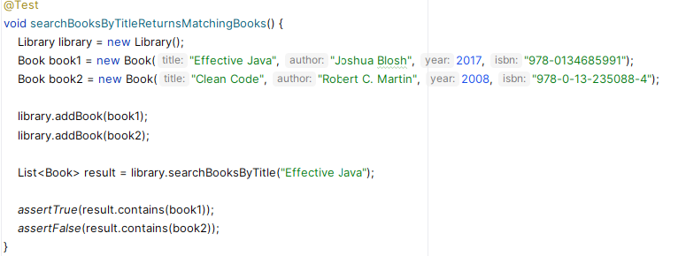

# 3. Assisting with the Implementation of New Business Rules in a Simple Legacy Project

Start by cloning the **bookai** project from the GitHub repository at <https://github.com/iblasquez/bookai>, then open it in your preferred IDE.

## 3.1 Getting an Overview of the Project

First, make sure the project compiles. Then take a quick look at the code to get a general idea.

The project is still in its early stages and appears to be part of a library domain. It includes three main classes: `Book`, `LibraryMember`, and `Library`.
So far, no tests have been written in `BookTest`.

For such a simple project, you don't need an AI coding assistant to understand the overall structure.

## 3.2 Generating Unit Tests for a Simple Class

To start on solid ground (and review what you learned earlier), begin by adding unit tests to this project.

### Covering the `Book` Class

- The `BookTest` class already exists. Open it, remove the placeholder test, and let your AI coding assistant suggest a set of tests that you can review and approve.
- Run the tests.
- Check the code coverage. Since `Book` is a simple POJO, two or three tests suggested by the assistant should be enough to reach 100% coverage.

*Note: If you don't know what a POJO is, you can ask your AI coding assistant to explain it.*

### Covering the `LibraryMember` Class

- Open the `LibraryMember` class. In the AI coding assistant chat, use the slash command `/tests` (or type `Generate unit tests`) to generate test code.

- Use your IDE to create the `LibraryMemberTest` class in the right place, and insert the generated code.
- Make sure the tests compile **without changing the production code**.
If needed, adjust **the test code** to make it work. For example, you may have to complete the `Book` constructor (with or without help from the assistant).

- If the assistant generates a test method like `borrowBookTwice`, you will need to decide whether to keep it.
The logic for borrowing a book that is already borrowed is not yet implemented. You can choose between:
  - Deleting the test, if this behavior is not important at this stage.
  - Keeping the test, if you think it should be handled now. In that case, you will have to update the production code so the test passes (with or without help from the assistant).

- Run the tests and check the code coverage.
- Review the `LibraryMember` class.

If some parts of `LibraryMember` are not covered by tests (and you want them to be), select those parts and use the `/tests` command to generate new tests.
Then, add the generated code to `LibraryMemberTest`, run the tests, and check the coverage again.

> **Reminder:** In a project, the goal is not always to reach 100% test coverage.

Here, the purpose is simply to show how to quickly add unit tests.
For now, we won’t write tests for the `Library` class.

## 3.3 Supporting the *Proper* Implementation of a New Domain Rule

### Understanding and Implementing the Rule for Validating an ISBN (`ISBNValidator` Class)

Go back to the `Book` class and look at its attributes.
You’ll see that `isbn` is one of them.

- You probably have a rough idea of what an **ISBN** is (a sequence of digits).
For more details, you can ask your AI coding assistant:  
    `Can you explain what an ISBN is?`

In this project, we are not interested in generating an ISBN, since it is assigned when a book is published.
However, it is important to **avoid human error when entering an ISBN**. Ensuring **data integrity** (valid and accurate data) is key to maintaining software quality.

An ISBN, like a credit card number or a health insurance number, likely includes a **checksum** to **verify its validity**.
So it’s not just a random set of digits. It follows a **domain rule**.
Let your AI coding assistant help you discover and implement that rule.

- Ask your assistant:  
  `Do you know if there’s a specific rule to check if an ISBN is valid?`

  The assistant should give you an explanation, and probably a Java implementation.
  - If not, ask directly:  
  `Can you give me a Java implementation of this domain rule?`

- Then create a new class called `ISBNValidator` and paste the generated code into it, after quickly checking that the implementation matches the rule description.

**Note: Since generative AI is probabilistic**, your assistant may have responded in different ways to the questions above.
You may end up with an implementation in `ISBNValidator` that **validates only one type of ISBN**, even though there are actually two: **ISBN-10** (used before 2007) and **ISBN-13**.

- You can **explore this domain rule further** by continuing the discussion with your assistant:  
`Is there another type of ISBN?` (ask this if the assistant only mentioned ISBN-13)  
`What is the structure of an ISBN-10?`  
`What is the structure of an ISBN-13?`  
`What is the difference between ISBN-10 and ISBN-13?`  

- **If the assistant initially gave you only one method** to check ISBN validity:
  - now ask:  
  `Can you give me a Java implementation for ISBN-10?`  
  (Adapt the question depending on what the assistant has already provided.)

  - Then add the new code to the `ISBNValidator` class, making sure it matches the domain rule.

- **Always review the assistant’s output before adding it to your code**.  
For example, make sure the ISBN-10 validation properly handles special cases, such as the use of the character "X".

### Testing the Domain Rule (`ISBNValidatorTest` Class)

- Next, create a class called `ISBNValidatorTest`. With the help of your assistant, generate tests that cover both ISBN validation methods.  
**Pay attention to the quality of your test code**, and make sure it follows **best practices**: avoid a single test with multiple assertions, and prefer well-named methods that follow the AAA pattern (Arrange, Act, Assert).  
To do this, it’s better to select the code to test and use the `/test` command (or the prompt `Generate unit tests`s) rather than simply placing the cursor inside the `ISBNValidatorTest` class and letting the assistant generate tests automatically.

- **Run the tests. Do they all pass?**  
If some fail, don’t change the production code right away. First, check whether the values used in the tests are correct. They may make the test pass, but are they really valid ISBNs?

- To **ensure test quality**, you must **pay attention to the quality of your test data**—which the AI coding assistant does not always guarantee.  
To make sure you're **using valid data**, you will now ***review*** and revise the generated tests by replacing the test values with **real ISBN examples**:

  - Use `9780321146533` when testing that a **valid ISBN-13** is accepted.
    This ISBN-13 corresponds to the book *Test-Driven Development* by Kent Beck.

  - Use `020161622X` when testing that a **valid ISBN-10** with an **X as the check digit** is accepted.
    This ISBN-10 corresponds to the original 1999 edition of *The Pragmatic Programmer* by Andrew Hunt and David Thomas.

  - Use `0321125215` when testing that a **valid ISBN-10** is accepted.
    This ISBN-10 corresponds to *Domain-Driven Design* by Eric Evans.

- **To test an invalid or malformed ISBN**, you can simply **change the last digit**, as it is the check digit.

- If the tests fail when using these valid examples, ask your assistant to regenerate the problematic code.

**Tip:** *As with any refactoring, follow a careful and **step-by-step approach when revising your tests** with real values. Update one test value at a time, rerun the test, and then move to the next one.*

- Once both ISBN validation rules are implemented and the test revision is complete, **run all tests and check code coverage** to ensure the `ISBNValidator` class is fully covered before applying a small production refactor.

### Improving the Quality of the Domain Rule Code

- Go back to the `ISBNValidator`r class.
The assistant has generated working code that meets the requirement—but is the code high quality? Now ask the assistant:  
`How can I improve the quality of the ISBNValidator class?`

- Since generative AI always offers an answer, the assistant should suggest a cleaner version of the code.
Check whether the improvements make sense to you. For example: Have magic numbers been removed? Were methods extracted? Are exceptions properly handled?
  - **If you're happy with the code quality**, replace the old code with the new one, then rerun the tests to make sure the ISBN validation rules still pass.

  - **If the code quality doesn’t meet your expectations**, be more specific by targeting one code smell at a time:  
    `Can you remove the magic numbers?`
    - If the result is acceptable, replace the previous code and rerun the tests.
    - If you think it can still be improved, continue the conversation and refactor step by step. Fix one code smell at a time and rerun the tests after each change.  
    `Can you extract methods?`  
    `[…]`

Remember that your **expertise and adherence to best practices are what ensure code quality.**
AI coding assistants can help you generate code quickly, but **careful review is essential** to avoid the buildup of technical debt, which can become costly over time—as shown in studies like [gitclear](https://www.gitclear.com/coding_on_copilot_data_shows_ais_downward_pressure_on_code_quality) and [uplevelteam](https://resources.uplevelteam.com/gen-ai-for-coding).  

Today, AI coding assistant models tend to replicate the technical debt present in the data they were trained on.
However, given the fast pace of progress in large language models (LLMs), we can hope that they will eventually benefit from higher-quality training data and new learning techniques, which could gradually improve the quality of the code they generate.

## 3.4 Assisting with Regular Expression Writing (Pattern Matching)

Regular expressions are patterns used to identify specific combinations of characters in strings.  
**Writing a regular expression is often seen as a tedious task by developers**, and an AI coding assistant can help you generate them quickly.

- Open the `LibraryMember` class and ask your assistant in the chat:  
`Can you create a regular expression to validate an email address?`

The assistant will likely suggest a regex starting with something like `^[a-zA-Z0-9._%+-]+`, where:  
&#8594; The `^` symbol marks the beginning of the line: the email address must start here.
&#8594; The characters in brackets `[…]+` specify that the email must contain one or more (`+`) of the listed characters: lowercase letters (`a-z`), uppercase letters (`A-Z`), digits (`0-9`), or certain special characters such as dot (`.`), underscore (`_`), percent (`%`), plus (`+`), or hyphen (`-`).
&#8594; The part that follows the `@` symbol—required in every email address—can vary and may be more or less strict depending on the assistant’s (probabilistic) output. If you have specific requirements for this part, feel free to share them with the assistant to refine the pattern.  

**Keep in mind that while the assistant can save you time on repetitive and tedious tasks, it is essential to check and adjust the generated code to ensure it meets your needs.**

- If you want to **add more constraints to domain names**, you can ask the assistant:  
`What are the common rules for domain names in email addresses?`

- Once you're familiar with those rules, ask your assistant to rewrite the `isValidEmail` method to take these constraints into account.

## 3.5 Exploring for the Joy of Discovering New Tools

- Email validation is not a feature specific to your application.
It’s clear that many developers have implemented this rule before you.
Out of curiosity, you could ask your assistant:  
`Can you write this code differently?`  
`Are there other ways to validate an email besides pattern matching?`  

- Your assistant will likely encourage you to explore further by suggesting questions like:  
`What are other ways to validate an email address in Java?`  
`What third-party libraries are available to validate email addresses in Java?`  
`[…]`  

This way, you’ll discover that there are several approaches to email validation besides pattern matching.
Why reinvent the wheel? After this enriching conversation, you can choose the solution that best fits your needs.

## 3.6 Adding the `searchBookByTitle` Feature

- Go to the end of the `Library` class and start typing:  
  `public List<Book> search`

- Let the AI coding assistant suggest a **method signature** and **implementation**.
The goal is to keep typing until it suggests: `public List<Book> searchBookByTitle(String Title)`  
After a quick check to confirm that the implementation matches the intended domain behavior, **accept it**.

- Then use the assistant to **generate tests** for this method. Select the method code and use the `/tests` command.
Make sure the code compiles by adding any missing `import` statements.

If a test fails, carefully review the **quality of the data used in the test**.
In some cases, if you're unlucky—just like I was—you might encounter the following **hallucination**:  

&#8594; At first glance, the test data may look correct, but the test fails on the `assertTrue` assertion.
In fact, the AI coding assistant mistakenly used the **author** of a book as the input parameter for the `searchBookByTitle` method—instead of the **title**.  
  This confusion is likely caused by ***primitive obsession*** in the `Book` constructor, which takes too many `String` parameters.
  **As a result, the assistant could not distinguish between the different `String` values and failed to identify the one representing the book title.**  
  To make the test pass with the current data, you would need to pass `123` as the input instead of `Effective Java`.

&#8594; However, using `123` as the input for the `searchBooksByTitle` method makes it clear that the test data is of poor quality.
From a human perspective, in the domain context of this application, `Clean Code` or `Effective Java` are recognizable as real book titles.  
    In the generated tests, the assistant incorrectly used those values as examples of author names, which is misleading and could cause confusion when reading or interpreting the tests later.
    Interestingly, the ISBN used in the *Effective Java* example wasn’t the *correct one*—it was actually the real ISBN for *Design Patterns: Elements of Reusable Object-Oriented Software* by the Gang of Four. 😉

&#8594; To improve readability (and therefore understanding) of the test, it's recommended to revise the test using **realistic and meaningful domain values**.  
After this revision, the updated test might look like this :

This hallucination is a good reminder that **you must carefully check the quality of test data generated by the assistant**.
Example values—just like the code—require your own review.  
However, it’s also worth noting that an assistant’s **hallucination** can sometimes **reveal design issues (code smells)** that only your expertise can identify.

- Once the tests are fixed, **run them again** to make sure they all pass.

- If the assistant generated code using a `for` loop but you prefer working with **streams**, select the entire `searchBookByTitle` method and ask the assistant:  
`Refactor this to use streams.`  
Then replace the existing code with the refactored version and rerun the tests to confirm that the behavior is unchanged.

## 3.7 Suggesting More Complex Code (with Streams)

- Now go to the end of the `Library` class and type a comment in your code describing a more complex feature, such as:  
`Implement a method to sort books by year, then by author name`

- You can also try the following comment:
`Implement a method to search for books by keyword in title or author`

The assistant will likely suggest an implementation that uses streams and lambda expressions (`->`).
If not, ask it to refactor the code using streams, just like before.

## 3.8 Exploring Other Use Cases

The last small use case you’ll explore in this project is data format conversion.
Ask your assistant in the chat:  
`Add a method to export book data as JSON.`

The assistant should then guide you on where and how to implement this method.

Depending on your context and needs, you’ll discover many other use cases as you move through the development process.
Now it’s your turn to explore!
